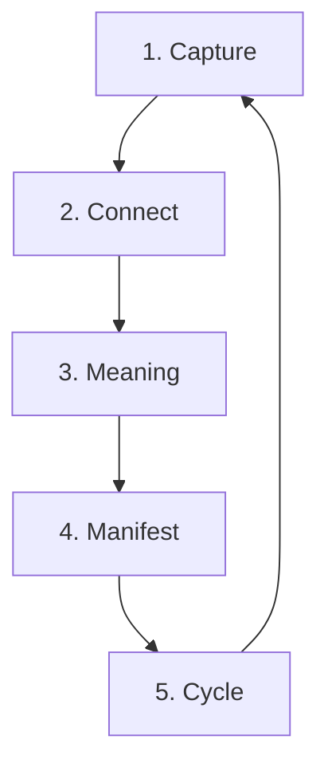

# ⚙️ OPERATIONS - 통합 운영 프로토콜 v3.0

> **통합**: sync_protocol + sync_workflow + daemon_workflow + cycle_protocol + efficiency_protocol + snapshot_workflow + junction_protocol + communication_protocol
> **버전**: 3.0
> **갱신**: 2026-02-15

---

## 🔄 5-Stage Cycle Protocol

### Overview


### Stage 1: CAPTURE (포착)

**Owner**: SA (Strategy Analyst)
**Duration**: 0-24h

#### Actions
```python
# 무조건 저장, 필터링 없이
def capture(signal):
    if is_signal(signal):  # 모든 것이 신호
        save_raw(signal)
        return signal_id
```

#### Input Sources
- 텔레그램 메시지
- YouTube 영상/댓글
- 드라이브 문서
- 클립보드 캡처
- 웹 스크래핑

#### Output
```
knowledge/raw_signals/rs-{id}_{source}.md
```

#### Tools
```bash
python execution/gdrive_import.py
python execution/clipboard_sentinel.py
python execution/telegram_webhook.py --capture
```

### Stage 2: CONNECT (연결)

**Owner**: SA
**Duration**: 24-48h

#### Actions
```python
# 패턴 발견, 관계 매핑
def connect(signals):
    patterns = find_patterns(signals)
    graph = build_connection_graph(patterns)
    return insights
```

#### Pattern Types
- **Temporal**: 시간 패턴 (반복, 주기)
- **Semantic**: 의미 연결 (주제, 감정)
- **Structural**: 구조 유사성
- **Emergent**: 떠오르는 트렌드

#### Output
```
knowledge/patterns/pattern_{date}.md
```

#### Tools
```bash
python execution/ontology_transform.py
python libs/memory_engine.py --connect
```

### Stage 3: MEANING (의미화)

**Owner**: CE (Chief Editor)
**Duration**: 48-72h

#### Actions
```python
# 개인 → 보편 전환
def create_meaning(patterns):
    personal = extract_personal_story(patterns)
    universal = transform_to_universal(personal)
    narrative = structure_narrative(universal)
    return content
```

#### Narrative Structure
```
The Hook (5%)
    ↓
Manuscript (90%)
    ↓
Afterglow (5%)
```

#### Output
```
knowledge/content/vol_{n}_{title}.md
```

#### Tools
```bash
python execution/five_agent_multimodal.py --role CE
python libs/skill_engine.py --skill content_generation
```

### Stage 4: MANIFEST (구현)

**Owner**: CD (승인) + AD (시각)
**Duration**: 72h (deadline)

#### Actions
```python
# MBQ 체크 + 시각화
def manifest(content):
    # CD: 최종 승인
    if not mbq_check(content):
        return revise(content)

    # AD: 시각화
    visuals = select_visuals(content)

    # 최종 결합
    return publish_ready(content, visuals)
```

#### MBQ Criteria
- **M**eaning: 철학 5개 중 1개+
- **B**rand: Aesop 톤 70%+
- **Q**uality: 구조 완결성

#### Output
```
knowledge/assets/publish_ready/
```

#### Tools
```bash
python execution/sovereign_judgment.py
python execution/async_five_agent_multimodal.py --vision
```

### Stage 5: CYCLE (순환)

**Owner**: TD (Technical Director)
**Duration**: Continuous

#### Actions
```python
# 백업, 아카이브, 다음 준비
def cycle():
    backup_current()
    archive_old()
    cleanup_temp()
    prepare_next()
    return ready_state
```

#### Maintenance Tasks
- 일일 백업
- 주간 아카이브
- 월간 정리
- 분기 최적화

#### Output
```
knowledge/archive/{year}/{month}/
```

#### Tools
```bash
python execution/cycle_manager.py
python execution/snapshot_workflow.py
```

---

## 🔁 Sync Protocol (동기화)

### Real-time Sync Points

#### 1. Task Board Sync
```python
# 모든 에이전트가 공유하는 작업판
SYNC_INTERVAL = 60  # seconds

def sync_task_board():
    with file_lock(TASK_BOARD):
        board = load_board()
        update_agent_status()
        save_board()
```

#### 2. Knowledge Base Sync
```python
# Git 기반 동기화
def sync_knowledge():
    git.pull()  # 최신 상태 가져오기
    process_local_changes()
    git.commit()
    git.push()  # 변경사항 공유
```

#### 3. Cloud Sync (Google Drive)
```bash
# rclone 기반 양방향 동기화
rclone sync local:knowledge/ remote:97layerOS/knowledge/ --update
```

### Conflict Resolution
```python
def resolve_conflict(local, remote):
    if local.timestamp > remote.timestamp:
        return local  # 최신 우선
    elif local.author == "CD":
        return local  # CD 우선
    else:
        return merge(local, remote)  # 병합
```

---

## 👹 Daemon Workflow (백그라운드)

### Active Daemons

#### 1. Clipboard Sentinel
```python
# 클립보드 감시 데몬
@daemon(interval=5)
def clipboard_sentinel():
    content = get_clipboard()
    if is_new(content) and is_relevant(content):
        capture_signal(content)
```

#### 2. Telegram Daemon
```python
# 텔레그램 메시지 수신
@daemon(webhook=True)
def telegram_daemon(update):
    message = parse_message(update)
    if requires_response(message):
        async_respond(message)
    capture_signal(message)
```

#### 3. Archive Daemon
```python
# 72시간 규칙 강제
@daemon(interval=3600)  # 1시간마다
def archive_daemon():
    drafts = get_old_drafts(hours=72)
    for draft in drafts:
        force_publish(draft)  # 강제 발행
```

#### 4. Shadow Daemon
```python
# 백그라운드 교차 검증
@daemon(trigger="task_complete")
def shadow_daemon(task_output):
    reviews = ShadowLogic().peer_review(task_output)
    if reviews.needs_improvement:
        notify_quietly(task.author, reviews.suggestions)
```

### Daemon Management
```bash
# 데몬 상태 확인
systemctl status 97layer-*.service

# 데몬 재시작
systemctl restart 97layer-telegram.service

# 로그 확인
journalctl -u 97layer-* -f
```

---

## 🔗 Junction Protocol (연결점)

### Inter-Agent Communication

#### Message Format
```json
{
    "from": "SA",
    "to": ["CE", "AD"],
    "type": "signal|task|review",
    "priority": "high|medium|low",
    "payload": {},
    "timestamp": "ISO 8601"
}
```

#### Communication Channels
```python
# 1. Direct (동기)
response = agent_hub.call("CE", task)

# 2. Async (비동기)
task_id = agent_hub.async_call("TD", task)

# 3. Broadcast (전체)
agent_hub.broadcast("meeting", agenda)

# 4. Shadow (조용히)
shadow_logic.whisper("SA", suggestion)
```

### API Endpoints
```
POST /api/junction/message
GET  /api/junction/status
POST /api/junction/task
GET  /api/junction/result/{task_id}
```

---

## ⚡ Efficiency Protocol

### Token Optimization

#### Layer 1: Query First
```python
# ❌ BAD
content = Read("entire_file.py")  # 20,000 tokens

# ✅ GOOD
matches = Grep("function_name")   # 100 tokens
content = Read(file, offset, limit)  # 500 tokens
```

#### Layer 2: Cache Everything
```python
@cache(ttl=86400)  # 24시간
def expensive_ai_call(prompt):
    return ai_engine.generate(prompt)
```

#### Layer 3: Batch Processing
```python
# ❌ BAD: N개 개별 호출
for item in items:
    process(item)

# ✅ GOOD: 1개 배치 호출
process_batch(items)
```

### Resource Management

#### CPU/Memory Limits
```yaml
resources:
  limits:
    cpu: "2"
    memory: "4Gi"
  requests:
    cpu: "0.5"
    memory: "1Gi"
```

#### Concurrent Tasks
```python
MAX_CONCURRENT = 5
semaphore = asyncio.Semaphore(MAX_CONCURRENT)

async def controlled_task():
    async with semaphore:
        await actual_task()
```

---

## 📸 Snapshot Workflow

### Snapshot Types

#### 1. System Snapshot
```bash
# 전체 시스템 상태 저장
python execution/create_snapshot.py --full
```

Output:
```
.snapshots/
└── 2026-02-15_18-30-00/
    ├── system_state.json
    ├── task_board.json
    ├── agent_status.json
    └── knowledge/
```

#### 2. Knowledge Snapshot
```bash
# 지식 베이스만 백업
python execution/create_snapshot.py --knowledge-only
```

#### 3. Incremental Snapshot
```bash
# 변경사항만 백업
python execution/create_snapshot.py --incremental
```

### Recovery
```bash
# 특정 시점으로 복원
python execution/recover_snapshot.py --timestamp "2026-02-15_18-30-00"
```

---

## 🚦 Communication Protocol

### Message Types

#### 1. Imperative (명령)
```python
{
    "type": "imperative",
    "action": "execute",
    "target": "task_123",
    "deadline": "2026-02-15T20:00:00Z"
}
```

#### 2. Informative (정보)
```python
{
    "type": "informative",
    "content": "Task completed successfully",
    "metadata": {...}
}
```

#### 3. Interrogative (질의)
```python
{
    "type": "interrogative",
    "question": "Should we proceed with deployment?",
    "options": ["yes", "no", "defer"],
    "timeout": 300
}
```

#### 4. Suggestive (제안)
```python
{
    "type": "suggestive",
    "suggestion": "Consider refactoring this module",
    "rationale": "High complexity detected",
    "priority": "low"
}
```

### Response Protocol

#### Acknowledgment
```python
# 모든 메시지는 3초 내 ACK
def handle_message(msg):
    send_ack(msg.id)  # 즉시
    result = process(msg)  # 처리
    send_result(result)  # 완료
```

#### Error Handling
```python
try:
    process(message)
except Exception as e:
    send_error(
        message_id=message.id,
        error_type=type(e).__name__,
        details=str(e),
        recovery_suggestion=suggest_fix(e)
    )
```

---

## 📊 Monitoring & Metrics

### Key Performance Indicators

#### System Health
```python
metrics = {
    "uptime": "99.9%",
    "response_time_p95": "< 500ms",
    "error_rate": "< 1%",
    "task_completion_rate": "> 95%"
}
```

#### Agent Performance
```python
agent_metrics = {
    "SA": {"signals_captured": 100, "patterns_found": 15},
    "CE": {"content_created": 10, "aesop_score": 0.75},
    "AD": {"visuals_selected": 20, "whitespace_ratio": 0.65},
    "CD": {"approvals": 8, "rejections": 2},
    "TD": {"automations": 5, "uptime": 0.999}
}
```

### Monitoring Commands
```bash
# 실시간 대시보드
python execution/dashboard_server.py

# 성능 리포트
python execution/progress_analyzer.py --period weekly

# 에러 로그
tail -f knowledge/logs/error.log | grep CRITICAL
```

---

## 🔧 Maintenance Windows

### Schedule
- **Daily**: 03:00-03:30 KST (백업)
- **Weekly**: Sunday 04:00-05:00 KST (정리)
- **Monthly**: 1st Sunday 02:00-06:00 KST (최적화)

### Maintenance Tasks
```python
def daily_maintenance():
    backup_knowledge()
    rotate_logs()
    cleanup_temp()

def weekly_maintenance():
    archive_old_signals()
    optimize_database()
    update_dependencies()

def monthly_maintenance():
    full_system_backup()
    performance_analysis()
    capacity_planning()
```

---

## 📚 Version History

- **v3.0** (2026-02-15): 8개 파일 → 1개 통합
  - sync_protocol.md
  - sync_workflow.md
  - daemon_workflow.md
  - cycle_protocol.md
  - efficiency_protocol.md
  - snapshot_workflow.md
  - junction_protocol.md
  - communication_protocol.md

---

> "시스템은 조용히 돌아가야 한다" — 97layerOS