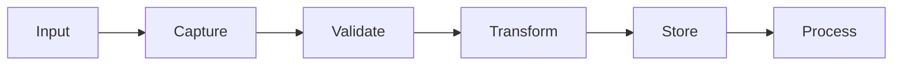

# 📝 PUBLISHING - 통합 퍼블리싱 전략 v3.0

> **통합**: uip_protocol + imperfect_publish_protocol + anti_algorithm_protocol + aesop_benchmark + communication_protocol (publishing parts)
> **버전**: 3.0
> **갱신**: 2026-02-15
> **성장**: 이 문서는 계속 진화합니다. 새로운 인사이트마다 추가됩니다.

---

## 🎯 Core Publishing Philosophy

### The 72-Hour Rule (핵심 원칙)

```python
def publishing_rule(draft):
    if hours_since_creation(draft) >= 72:
        return publish(draft)  # 무조건 발행
    else:
        return continue_refining(draft)
```

**왜 72시간인가?**
- 24h: 초기 열정
- 48h: 숙성 기간
- 72h: 결정의 순간
- 72h+: 과도한 다듬기 (금지)

> "완벽한 마침표를 기다리다 문장을 잃는다"

---

## 📖 UIP - Unified Input Protocol

### Input Sources (통합 입력)

#### 1. Telegram Messages
```python
@telegram_handler
def capture_message(message):
    signal = {
        "source": "telegram",
        "author": message.from_user,
        "content": message.text,
        "media": message.photo or message.video,
        "timestamp": message.date,
        "context": get_conversation_context(message)
    }
    save_to_raw_signals(signal)
```

#### 2. YouTube Signals
```python
def capture_youtube(video_id):
    signal = {
        "source": "youtube",
        "title": video.title,
        "transcript": video.transcript,
        "comments": video.top_comments[:10],
        "metadata": {
            "views": video.view_count,
            "duration": video.duration,
            "published": video.publish_date
        }
    }
    return signal
```

#### 3. Google Drive Documents
```python
def import_gdrive():
    for doc in drive.list_files():
        if doc.modified > last_sync:
            content = drive.download(doc.id)
            process_document(content)
```

#### 4. Clipboard Sentinel
```python
@daemon(interval=5)
def clipboard_monitor():
    current = get_clipboard()
    if is_new(current) and is_meaningful(current):
        capture_as_signal(current)
```

### Signal Processing Pipeline



---

## ✍️ Imperfect Publishing Protocol

### Publishing Stages

#### Stage 1: Draft (0-24h)
```markdown
# 초안 상태
- 날것의 아이디어
- 문법 오류 OK
- 구조 미완성 OK
- 핵심만 있으면 됨
```

#### Stage 2: Refine (24-48h)
```markdown
# 다듬기
- 구조 정리
- 톤 조정
- 핵심 메시지 명확화
- 여전히 불완전 OK
```

#### Stage 3: Publish (48-72h)
```markdown
# 발행 결정
- MBQ 체크 (Meaning, Brand, Quality)
- 60% 완성도면 충분
- "Good Enough" 기준
```

#### Stage 4: Forced Release (72h+)
```python
# 강제 발행
if draft.age > 72:
    if draft.completion < 30:
        add_disclaimer("*초기 생각 기록")
    publish_immediately(draft)
    log("Forced by 72-hour rule")
```

### Content Types & Formats

#### 1. Instagram Post
```yaml
Format:
  Hook: 첫 문장으로 주목
  Visual: 모노크롬, 여백 60%+
  Caption: 200-300자
  Hashtags: 최대 5개 (본질적인 것만)
```

#### 2. Long-form Article
```yaml
Structure:
  Opening: 개인적 경험 (20%)
  Bridge: 보편적 전환 (10%)
  Core: 핵심 메시지 (60%)
  Closing: 여운 (10%)
Word Count: 1000-2000
Reading Time: 5-10분
```

#### 3. Micro-thoughts
```yaml
Format:
  Single Insight: 한 문장
  Context: 2-3문장 보충
  Question: 열린 질문
Length: < 280자 (트윗 길이)
```

---

## 🚫 Anti-Algorithm Protocol

### What We DON'T Do

#### ❌ Algorithm Chasing
```python
# 우리가 하지 않는 것
forbidden_practices = [
    "hashtag_stuffing",       # 해시태그 도배
    "engagement_baiting",      # 좋아요 구걸
    "trend_jacking",          # 트렌드 무작정 따라가기
    "clickbait_titles",       # 낚시 제목
    "fake_urgency",          # 가짜 긴급성
    "FOMO_marketing"         # 불안 마케팅
]
```

#### ✅ What We DO Instead
```python
# 우리의 방식
our_approach = {
    "timing": "우리의 리듬대로",
    "content": "본질적 가치 중심",
    "audience": "찾아오는 사람만",
    "growth": "유기적 성장",
    "metrics": "의미 > 숫자"
}
```

### Publishing Rhythm

```python
class PublishingRhythm:
    """우리만의 리듬"""

    def __init__(self):
        self.forced_schedule = None  # 강제 스케줄 없음
        self.algorithm_optimization = False
        self.natural_flow = True

    def decide_when_to_publish(self, content):
        if content.is_ready:
            return "now"
        elif content.age >= 72:
            return "forced_now"
        else:
            return "continue_nurturing"
```

---

## 📐 Aesop Benchmark (톤 가이드)

### The 70% Rule
```
우리 톤 = Aesop 70% + 우리만의 30%
```

### Aesop Elements (70%)

#### 1. Minimalist Language
```python
aesop_style = {
    "adjectives": "minimal",      # 형용사 최소화
    "sentences": "short",         # 짧은 문장
    "structure": "clear",         # 명확한 구조
    "tone": "understated"        # 절제된 톤
}
```

#### 2. Product as Philosophy
```
"제품은 철학의 그릇이다"
- 기능 설명 < 철학 전달
- 스펙 나열 < 경험 묘사
- 판매 < 교육
```

#### 3. Literary References
```python
references = {
    "literature": ["보르헤스", "카프카", "칼비노"],
    "philosophy": ["벤야민", "들뢰즈", "바르트"],
    "approach": "자연스러운 인용, 과시 없이"
}
```

### Our Unique 30%

#### 1. Korean Sensibility
```python
korean_elements = {
    "정": "따뜻한 연결",
    "여백": "동양적 공간미",
    "은유": "직접 표현보다 암시",
    "계절감": "시간의 흐름 인지"
}
```

#### 2. Digital Native
```python
digital_elements = {
    "emoji": "최소한만, 의미 있게",
    "formatting": "마크다운 문법 활용",
    "links": "깊이 있는 레퍼런스",
    "multimedia": "텍스트 + 이미지 조화"
}
```

---

## 📊 Content Quality Metrics

### MBQ Framework

#### M - Meaning (의미)
```python
def check_meaning(content):
    philosophies = [
        "진정성",
        "실용성",
        "우아함",
        "정밀함",
        "혁신"
    ]

    matches = count_philosophy_alignment(content, philosophies)
    return matches >= 1  # 최소 1개 철학과 일치
```

#### B - Brand (브랜드)
```python
def check_brand(content):
    aesop_score = calculate_aesop_alignment(content)
    woohwahae_essence = check_brand_essence(content)

    return aesop_score >= 0.7 and woohwahae_essence
```

#### Q - Quality (품질)
```python
def check_quality(content):
    return all([
        has_clear_structure(content),
        grammar_acceptable(content),  # 완벽 불필요
        message_coherent(content),
        length_appropriate(content)
    ])
```

---

## 🎨 Visual Publishing Guidelines

### Image Selection Criteria

#### Approved ✅
```yaml
Monochrome: 흑백 또는 단색조
Whitespace: 60% 이상 여백
Natural Light: 자연광 선호
Minimal Objects: 1-3개 요소
Texture: 자연스러운 질감
```

#### Rejected ❌
```yaml
Oversaturated: 과도한 채도
Cluttered: 복잡한 구성
Artificial: 인위적 조명
Busy Background: 산만한 배경
Heavy Filters: 과도한 필터
```

### Typography Rules

#### Korean
```css
.korean-text {
    font-family: 'Noto Serif CJK KR', serif;
    font-weight: 400;
    line-height: 1.8;
    letter-spacing: -0.02em;
}
```

#### English
```css
.english-text {
    font-family: 'Crimson Text', serif;
    font-weight: 400;
    line-height: 1.6;
    letter-spacing: 0;
}
```

---

## 📅 Publishing Calendar

### No Fixed Schedule
```python
# 우리는 달력에 묶이지 않는다
class PublishingCalendar:
    def __init__(self):
        self.fixed_dates = []  # 비어있음
        self.algorithm_optimal_times = None  # 무시

    def next_publish_date(self):
        return "When it feels right"
```

### Natural Rhythm
- **Morning Thoughts**: 새벽 사색 (if any)
- **Afternoon Insights**: 오후 통찰 (if any)
- **Evening Reflections**: 저녁 성찰 (if any)
- **Random Moments**: 불시의 깨달음 (anytime)

---

## 📈 Growth Philosophy

### Organic Growth Only
```python
growth_strategy = {
    "followers": "찾아오는 사람만",
    "engagement": "진정한 연결만",
    "reach": "닿을 사람에게만",
    "virality": "의도하지 않음"
}
```

### Success Metrics
```python
# 우리의 성공 지표
our_metrics = {
    "depth_over_width": True,
    "quality_over_quantity": True,
    "resonance_over_reach": True,
    "meaning_over_metrics": True
}

# 무시하는 지표
ignored_metrics = [
    "follower_count",
    "like_rate",
    "share_count",
    "impression_rate"
]
```

---

## 🔄 Iteration Protocol

### Content Evolution
```
v1.0 (Draft) → v1.1 (Refined) → v1.2 (Published) → v1.3 (Updated)
```

각 버전은 이전 버전을 포함하며 성장합니다.

### Knowledge Accumulation
```python
def update_content(existing, new_insight):
    """지식은 쌓여간다, 대체되지 않는다"""
    existing.add_section(new_insight)
    existing.version += 0.1
    existing.last_updated = now()
    return existing  # 파편화 없이 성장
```

---

## 📚 Version History

- **v3.0** (2026-02-15): 대통합 - 5개 파일 → 1개
  - uip_protocol.md
  - imperfect_publish_protocol.md
  - anti_algorithm_protocol.md
  - aesop_benchmark.md
  - communication_protocol (publishing parts)

- **v2.5** (2026-02-10): Visual guidelines 추가
- **v2.0** (2026-02-01): 72시간 규칙 확립
- **v1.0** (2026-01-15): 초기 퍼블리싱 전략

---

## 🌱 Future Additions (성장 예정)

이 섹션에 새로운 인사이트가 추가됩니다:
- [ ] Newsletter 전략
- [ ] Podcast 가이드라인
- [ ] Video 콘텐츠 원칙
- [ ] Community 운영 철학

---

> "파편화하지 말고 축적하라. 버전을 올리며 성장하라." — 97layerOS