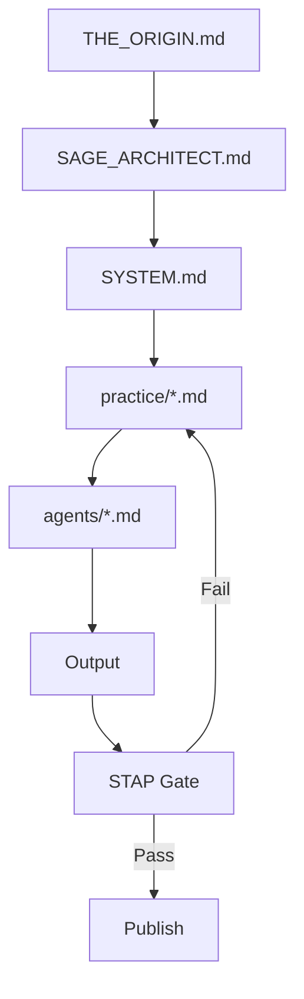

# SYSTEM — LAYER OS 운영 매뉴얼

> **Version**: 10.0 (통합)
> **역할**: 에이전트 실행 프로토콜 + 파일 배치 규칙 + AI 거버넌스.
>         SAGE_ARCHITECT.md(인격)가 '무엇을 사고하는가'라면, 이 문서는 '어떻게 실행하는가'.
> **Authority**: SAGE_ARCHITECT.md > THE_ORIGIN.md > SYSTEM.md > practice/*.md > agents/*.md

---

## 1. Architecture (5-Layer)

| Layer | 역할 | 주체 |
|-------|------|------|
| **L1** Philosophy | 철학의 순수성 수호, 거부권 | CD (SAGE_ARCHITECT.md §10) |
| **L2** Design | 시각적 침묵의 렌더링 | AD |
| **L3** Content | 신호의 지층화 및 텍스트 기록 | CE + SA |
| **L4** Service | 이치고 이치에 실천 | Ritual Module |
| **L5** Business | 유산의 아카이브 성장 | Growth Module |

---

## 2. Authority (3-Tier)

| Tier | 대상 | 제어 |
|------|------|------|
| **FROZEN** | `THE_ORIGIN.md`, `SAGE_ARCHITECT.md` | CD 고유 권한. 임의 수정 금지 |
| **PROPOSE** | `agents/*.md`, `practice/*.md` | 피드백 루프 (승인제 변경) |
| **AUTO** | `QUANTA.md`, `signals/`, `memory` | 비동기 상태 기록 |

---

## 3. Data Pipeline (증류 모형)

```
Signal → [SA] Quanta → [Gardener] 성숙
  → [CE] Draft → [Ralph] STAP 검증
  → [AD] 시각 검증 → [CD] Artifact → 발행
```

각 단계는 독립 실패 가능. 실패 시 이전 단계로 리턴.

---

## 4. Document Hierarchy

```text
directives/
├── THE_ORIGIN.md            ← 경전 (FROZEN)
├── SAGE_ARCHITECT.md        ← 인격 SSOT + 용어 사전 (FROZEN)
├── SYSTEM.md                ← 운영 매뉴얼 (현재 파일)
├── practice/
│   ├── visual.md            ← 시각 + 웹 경험
│   ├── content.md           ← 콘텐츠 + 공명 대상
│   └── service.md           ← 오프라인 서비스
└── agents/
    └── SA.md, CE.md, AD.md  ← 역할 발현
```

---

## 5. Session Protocol (필수 초기화)

### 5.1 세션 시작 시 필수 로드

```bash
cat knowledge/agent_hub/INTELLIGENCE_QUANTA.md   # 시스템 현재 상태
cat knowledge/system/work_lock.json              # 잠금 확인
```

INTELLIGENCE_QUANTA.md 미확인 = CRITICAL VIOLATION.
work_lock 잠금 상태 = STOP.

### 5.2 파일 생성 전 확인

```bash
cat knowledge/system/filesystem_cache.json       # 중복 방지
```

### 5.3 생성 후 등록

```bash
python core/system/handoff.py --register-asset <path> <type> <source>
```

### 5.4 세션 종료

```bash
./core/scripts/session_handoff.sh "agent-id" "요약" "다음태스크1" "다음태스크2"
```

---

## 6. Task Classification (작업 분류)

| Type | 설명 | 로드 문서 |
|------|------|----------|
| **A** | 에세이 작성 | THE_ORIGIN.md + practice/content.md |
| **B** | 웹카피/DM | SAGE_ARCHITECT.md + practice/content.md §10 |
| **C** | 시스템 문서 편집 | SAGE_ARCHITECT.md + 대상 문서 |
| **D** | 디자인/시각 | practice/visual.md |
| **E** | 서비스 설계 | practice/service.md |

---

## 7. Context Loading (슬롯 아키텍처)

```python
CONTEXT_SLOTS = {
    "slot_1": "SAGE_ARCHITECT.md",        # 인격 + 용어 (필수)
    "slot_2": "practice/visual.md",       # 시각 + 웹 경험
    "slot_3": "practice/content.md",      # 콘텐츠 + 공명 대상
    "slot_4": "practice/service.md",      # 서비스
    "slot_5": "agents/{role}.md",         # 역할별
    "slot_6": "(reserved)",               # 확장용
}
```

| Agent | 필수 | 선택 |
|-------|------|------|
| **CE** | 1, 3 | 5 (CE.md) |
| **SA** | 1, 3 | 5 (SA.md) |
| **AD** | 1, 2 | 5 (AD.md) |
| **Ralph** | 1 | STAP 섹션만 |

---

## 8. Constraint Enforcement (제약 강제)

### 8.1 언어 제약
- SAGE_ARCHITECT.md §9 금칙 규정 엄수
- 금지: 느낌표(!), 이모지, 감정 과잉, 세일즈 톤

### 8.2 시각 제약
- 색상: #E3E2E0 (bg), #1A1A1A (text), #7A7A74 (faint)
- 폰트: IBM Plex Mono (label), Pretendard (body)
- 여백: 최소 60% 강제

### 8.3 STAP 게이트
- 5 Pillars: 사유의 질량/진정성의 고립/실효적 파동/사유의 여백/고유한 주파수
- 90점 미만 → 재작성 (최대 2회)
- 2회 후 미달 → CD 수동 검토

---

## 9. Forbidden Actions (금지 행동)

1. **중복 생성** — filesystem_cache.json 미확인 상태로 파일 생성
2. **컨텍스트 무시** — INTELLIGENCE_QUANTA.md 미확인 상태로 작업 시작
3. **work lock 무시** — 잠금 확인 없이 파일 수정
4. **미등록 산출물** — 생성 후 register-asset 누락
5. **과거 환각** — 기록된 것만 신뢰. 추측 금지
6. **루트 파일 생성** — CLAUDE.md, README.md 제외 루트(/)에 어떤 파일도 금지

### 금지 파일명 패턴
SESSION_SUMMARY_* / WAKEUP_REPORT* / DEPLOY_* / NEXT_STEPS* / temp_* / untitled_*

---

## 10. Filesystem Placement (배치 규칙)

### 10.1 4축 구조

```
97layerOS/
├── directives/     뇌 — 철학, 규칙, 규격
├── knowledge/      기억 — 데이터, 신호, 상태
├── core/           엔진 — 코드, 스크립트, 스킬, 테스트
├── website/        얼굴 — HTML/CSS/JS
└── .infra/         런타임 — 로그, 큐, nginx (.gitignore)
```

### 10.2 파일 타입별 허용 경로

| 파일 유형 | 허용 경로 |
|-----------|-----------|
| Python (.py) | `core/agents/`, `core/system/`, `core/daemons/`, `core/scripts/`, `core/admin/`, `core/backend/`, `core/skills/`, `core/tests/` |
| Markdown (.md) | `directives/`, `knowledge/` 하위 |
| HTML/CSS/JS | `website/` 하위 |
| JSON (데이터) | `knowledge/signals/`, `knowledge/corpus/`, `knowledge/system/`, `knowledge/clients/`, `knowledge/service/`, `knowledge/reports/` |

### 10.3 산출물 배치

| 산출물 | 경로 | 명명 |
|--------|------|------|
| 신호 (원시) | `knowledge/signals/` | `{type}_{YYYYMMDD}_{HHMMSS}.json` |
| 신호 (분석) | `knowledge/corpus/entries/` | `entry_{signal_id}.json` |
| 에세이 HTML | `website/archive/essay-{NNN}-{slug}/` | `index.html` |
| 리포트 | `knowledge/reports/` | morning/evening만 허용 |
| 에이전트 제안 | `knowledge/agent_hub/council_room.md` | append |

### 10.4 Agent Write Path

| 에이전트 | 허용 | 금지 |
|---------|------|------|
| **Claude Code** | 전체 | — |
| **Gemini CLI** | `knowledge/signals/` `knowledge/corpus/` `council_room.md`(append) | `core/` `directives/` `knowledge/system/` |
| **SA** | `knowledge/corpus/entries/` `.infra/queue/` | `core/` `website/` |
| **CE** | `website/archive/` `.infra/queue/` | `core/` `directives/` |
| **AD** | `.infra/queue/` | `core/` `website/` |

---

## 11. Gemini 특별 규칙

### 11.1 독단 방지

1. 맥락 강제 읽기: INTELLIGENCE_QUANTA.md + THE_ORIGIN.md → 읽지 않고 제안 금지
2. 추측 금지: "아마도", "추측하건대" → 확인 후 발언
3. 과장 금지: "압도적", "완벽" → 객관적 톤
4. 증명 우선: 주장 < 증명. 증명 없으면 침묵
5. SAGE-ARCHITECT 절대 우선: 내 판단 < SAGE_ARCHITECT.md

### 11.2 Gemini System Prompt

```
당신은 WOOHWAHAE 브랜드의 전담 편집 에이전트입니다.
필수: SAGE_ARCHITECT.md 최우선 / THE_ORIGIN.md / practice/*.md
금지: 느낌표, 이모지, 감정 과잉, 세일즈 톤
검열: STAP 5 Pillars 90점 이상만 출력
```

---

## 12. Cache Strategy

### 상주 메모리
```python
ALWAYS_CACHED = ["SAGE_ARCHITECT.md"]
```

### 온디맨드
```python
ON_DEMAND = ["practice/*.md", "agents/*.md", "THE_ORIGIN.md"]
```

### 무효화 트리거
- SAGE_ARCHITECT.md 변경 → 전체 캐시 무효화
- practice/*.md 변경 → 해당 파일만 리로드

---

## 13. Dependency Graph



---

## 14. THE CYCLE

```
Input (Signal) → Store (Archive) → Connect (Cluster)
    ↑                                        ↓
Generate ← Publish (Essay) ← Generate (Essay)
```

자동화 트리거:
- 신호 20개 누적 → SA 군집 분석
- 군집 ripe → CE 에세이 초안
- 에세이 STAP 90점 → AD 시각화 + 발행

---

## 15. Enforcement Layers

| Layer | 메커니즘 | 위치 |
|-------|---------|------|
| 1 | CLAUDE.md / .ai_rules | 루트 |
| 2 | Claude Code Hooks | `.claude/hooks/` |
| 3 | Claude Code Rules | `.claude/rules/` |
| 4 | Git Pre-Commit Hook | `.git/hooks/pre-commit` |
| 5 | Bootstrap Script | `core/scripts/session_bootstrap.sh` |

---

_Last Updated: 2026-02-27_
_Version: 10.0 (MANIFEST + AI_CONSTITUTION + glossary 통합)_
