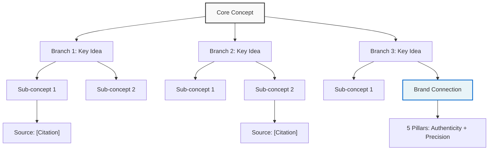

# 🛸 Anti-Gravity Skill

## Overview

AI 작업에서 인지 부하를 제거하고 구조화된 자산(Asset)을 생성하여, 단순 텍스트 응답이 아닌 실질적으로 재사용 가능한 지식 제품을 만든다.

## Core Philosophy

> "Remove Cognitive Load, Produce Structured Assets"
> 생각의 무게를 덜어내고, 형태 있는 자산을 남긴다.

**Anti-Gravity Operation**:
- 사용자는 **무엇**만 요청 (What)
- 시스템이 **어떻게** 처리 (How)
- 결과는 **재사용 가능한 자산** (Asset)

## Three Core Principles

### 1. Source Grounding (근거 기반)

**NotebookLM-style**: 모든 분석과 생성은 검증된 출처에서만.

```python
source_grounding_protocol = {
    "rule": "Only use verified sources from knowledge/sources/",
    "sources": [
        "knowledge/sources/youtube/",    # YouTube transcripts
        "knowledge/sources/pdf/",        # PDF documents
        "knowledge/sources/web/",        # Web articles
        "knowledge/sources/gdrive/"      # Google Drive docs
    ],
    "mandatory": [
        "Citation for every claim",
        "Timestamp for video sources",
        "Page number for PDF sources",
        "URL + archive date for web sources"
    ]
}
```

**✅ DO**:
- 출처가 `knowledge/sources/`에 저장된 것만 사용
- 모든 주장에 인용(Citation) 필수
- 비디오는 타임스탬프 필수 (예: `[03:42]`)
- PDF는 페이지 번호 필수 (예: `p.15`)

**❌ DON'T**:
- 검증되지 않은 "일반적 지식" 사용 금지
- 출처 없는 주장 금지
- 환각(Hallucination) 절대 금지

### 2. Multi-modal Synthesis (다중 형식 합성)

**Output**: 텍스트만으로는 부족. 3가지 자산을 동시 생성.

```markdown
Input: YouTube URL / PDF / Web Article
  ↓
Process: Junction Protocol (5-Agent)
  ↓
Output: 3 Assets
  1️⃣ Audio Overview (Podcast Script)
  2️⃣ Visual Deck (Slide Presentation)
  3️⃣ Mind Map (Mermaid Diagram)
```

#### Output 1: Audio Overview (음성 개요)

**Format**: 2-Host Podcast Dialogue

```markdown
# Audio Script: [Title]

**Duration**: ~5-7 minutes
**Style**: Conversational, Natural

---

## Opening (30 seconds)

**Host A**: [Opening hook - 호기심 유발]

**Host B**: [Echo + Context - 맥락 제공]

---

## Core Discussion (4-5 minutes)

**Host A**: [Key Point 1 with citation]

**Host B**: [Clarification + Example]

**Host A**: [Key Point 2 with citation]

**Host B**: [Connection to Brand Philosophy]

---

## Closing (30 seconds)

**Host A**: [Summary + Open Question]

**Host B**: [Afterglow - 여운]

---

## Source Citations

- [00:42] YouTube: "Title" by Author
- [02:15] PDF: "Document" p.23
```

**Validation**:
- [ ] 5-7분 분량 (900-1400 words)
- [ ] 자연스러운 대화 흐름
- [ ] 모든 인용 타임스탬프 포함
- [ ] 브랜드 5 Pillars 중 2개+ 연결

#### Output 2: Visual Deck (시각 슬라이드)

**Format**: Slide-by-slide structure with image prompts

```markdown
# Visual Deck: [Title]

**Total Slides**: 8-12
**Style**: Minimalist, 60%+ whitespace, monochrome

---

## Slide 1: Cover

**Visual Prompt**: [Midjourney/DALL-E prompt]
- "Minimalist abstract composition, white space, natural light, monochrome"

**Text**:
- Title: [Main Title]
- Subtitle: [One-line essence]

---

## Slide 2: Hook

**Visual Prompt**: [Image prompt for hook concept]

**Text**:
- Key Quote: "[Opening statement]"
- Source: [Citation]

---

## Slide 3-10: Core Content

[Repeat pattern]:
- **Visual Prompt**: [Specific image generation prompt]
- **Text**: [1-3 bullet points maximum]
- **Source**: [Citation with timestamp/page]

---

## Slide 11: Integration

**Visual Prompt**: "WOOHWAHAE brand visual - hair, simplicity, elegance"

**Text**:
- Connection to Brand: [How this relates to Slow Life]

---

## Slide 12: Closing

**Visual Prompt**: "Open-ended question visual, contemplative mood"

**Text**:
- Open Question: "[Thought-provoking question]"
```

**Validation**:
- [ ] 8-12 슬라이드
- [ ] 모든 슬라이드에 이미지 프롬프트
- [ ] 슬라이드당 텍스트 3줄 이하
- [ ] 60%+ 여백 유지
- [ ] Brand Visual Identity 준수

#### Output 3: Mind Map (지식 지도)

**Format**: Mermaid.js diagram

```markdown
# Mind Map: [Title]

## Structure: Radial or Hierarchical


```

**Validation**:
- [ ] 핵심 개념 1개 (중앙)
- [ ] 주요 가지 3-5개
- [ ] 각 가지에 출처 인용
- [ ] Brand Pillars 연결점 명시
- [ ] Mermaid.js 렌더링 가능

### 3. MCP Connector (도구 우선 통합)

**Tool-Use First**: 외부 도구 활용을 최우선으로.

```python
mcp_integration_priority = [
    "1. Context7: Latest library docs (Claude MCP)",
    "2. Google Drive: Long-term knowledge storage",
    "3. NotebookLM: Deep document analysis",
    "4. Perplexity: Real-time web research",
    "5. Gemini: Multi-modal processing (video/image)"
]
```

**Integration Points**:

```python
# Example: YouTube Analysis with MCP
def analyze_youtube_with_anti_gravity(url: str):
    # Step 1: Source Grounding
    transcript = youtube_transcript_api.get(url)
    save_to_sources(transcript, f"knowledge/sources/youtube/{video_id}.json")

    # Step 2: Multi-modal Synthesis
    audio_script = generate_audio_overview(transcript)
    visual_deck = generate_slide_deck(transcript)
    mind_map = generate_mind_map(transcript)

    # Step 3: MCP Connector
    gdrive_sync.upload(audio_script, folder="assets/audio")
    notebooklm.add_source(visual_deck)

    # Step 4: Asset Registration
    asset_manager.register(audio_script, type="audio_overview")
    asset_manager.register(visual_deck, type="visual_deck")
    asset_manager.register(mind_map, type="mind_map")

    return {
        "assets": [audio_script, visual_deck, mind_map],
        "sources": [transcript],
        "status": "grounded"
    }
```

## Junction Protocol Integration

Anti-Gravity는 Junction Protocol의 5단계와 완벽히 통합된다:

```markdown
1. Capture (포착)
   → SA: YouTube URL → Transcript → knowledge/sources/youtube/

2. Connect (연결)
   → SA: Transcript → 5 Pillars 매칭 → 기존 지식베이스 링크

3. Meaning (의미)
   → CE: Source Grounding → Aesop-style 내러티브 → Audio Script

4. Manifest (구현)
   → AD + CE: Visual Deck + Mind Map 생성
   → Brand Visual Identity 적용

5. Cycle (순환)
   → CD + TD: Ralph Loop MBQ 검증 → Asset Registration
   → GDrive Sync → NotebookLM 통합
```

## Use Cases

### 1. YouTube Video Analysis

**Input**: `https://youtu.be/xxxxx`

**Process**:
1. Extract transcript → `knowledge/sources/youtube/xxxxx.json`
2. 5-Agent Junction Protocol
3. Generate 3 assets (Audio + Deck + Map)

**Output**:
- `knowledge/assets/audio/youtube_xxxxx_overview.md`
- `knowledge/assets/decks/youtube_xxxxx_deck.md`
- `knowledge/assets/maps/youtube_xxxxx_map.md`

### 2. PDF Document Summarization

**Input**: PDF upload via Telegram

**Process**:
1. Extract text + images → `knowledge/sources/pdf/document_name.json`
2. Source Grounding with page numbers
3. Multi-modal synthesis

**Output**:
- Audio Overview (Podcast-style summary)
- Visual Deck (Key points with citations)
- Mind Map (Concept relationships)

### 3. Web Article Deep Dive

**Input**: URL or web scrape

**Process**:
1. Archive article → `knowledge/sources/web/article_title.json`
2. Citation with URL + archive timestamp
3. Brand alignment check

**Output**:
- Audio: Conversational summary
- Deck: Visual storytelling
- Map: Knowledge connections

### 4. Brand Strategy Research

**Input**: Competitor analysis, market research

**Process**:
1. Compile sources → `knowledge/sources/research/topic_name/`
2. Cross-reference with 5 Brand Pillars
3. Generate strategic insights

**Output**:
- Audio: Executive briefing
- Deck: Board presentation
- Map: Strategic landscape

## Validation Criteria

### Source Grounding Check

- [ ] All claims have citations
- [ ] All sources saved to `knowledge/sources/`
- [ ] Timestamps/page numbers included
- [ ] No hallucinated information

### Multi-modal Completeness

- [ ] Audio Script: 5-7 minutes, 2-host dialogue
- [ ] Visual Deck: 8-12 slides, image prompts
- [ ] Mind Map: Mermaid.js, brand connections

### MCP Integration

- [ ] Assets uploaded to Google Drive
- [ ] Sources added to NotebookLM (if applicable)
- [ ] Asset Manager registration complete
- [ ] Ralph Loop MBQ validation passed

### Brand Alignment

- [ ] 2+ of 5 Brand Pillars referenced
- [ ] Aesop Benchmark ≥ 70%
- [ ] Slow Life philosophy evident
- [ ] 72-Hour Rule compliance (completion over perfection)

## Tools & Scripts

### YouTube Analyzer

```bash
# Analyze YouTube video
python execution/system/youtube_analyzer.py --url "https://youtu.be/xxxxx"

# Output:
# ✅ Transcript saved: knowledge/sources/youtube/xxxxx.json
# ✅ Audio Script: knowledge/assets/audio/xxxxx_overview.md
# ✅ Visual Deck: knowledge/assets/decks/xxxxx_deck.md
# ✅ Mind Map: knowledge/assets/maps/xxxxx_map.md
```

### PDF Processor

```bash
# Process PDF document
python execution/system/pdf_processor.py --file document.pdf

# Output: Same 3 assets with page citations
```

### Telegram Integration

```bash
# In Telegram
/youtube https://youtu.be/xxxxx
/pdf [attach PDF file]
/web https://example.com/article

# Bot automatically applies Anti-Gravity
```

## Anti-Gravity vs Traditional AI

| Aspect | Traditional AI | Anti-Gravity |
|--------|---------------|--------------|
| **Input** | Vague prompt | Verified source |
| **Process** | Black box | Junction Protocol |
| **Output** | Text blob | 3 structured assets |
| **Validation** | Manual review | Ralph Loop MBQ |
| **Reuse** | Copy-paste | Asset library |
| **Citation** | Optional | Mandatory |
| **Format** | Single mode | Multi-modal |

## Common Pitfalls

### 1. "Source-less Synthesis"

❌ 출처 없이 "일반적으로 알려진 바에 따르면..."
✅ `[Source: YouTube "Title" 03:42] According to the speaker...`

### 2. "Text-Only Output"

❌ 긴 텍스트 보고서만 생성
✅ Audio Script + Visual Deck + Mind Map 3종 세트

### 3. "Manual Citation"

❌ 나중에 출처 추가하기
✅ 생성 시점부터 자동 인용

### 4. "Single-Use Content"

❌ 일회성 응답
✅ Asset으로 등록 → 재사용 가능

## Integration with Existing Skills

### With Brand Voice Skill

```python
# Anti-Gravity output must pass Brand Voice validation
audio_script = anti_gravity.generate_audio(source)
validated = brand_voice.validate(audio_script)

if validated['aesop_score'] < 0.70:
    audio_script = brand_voice.enhance(audio_script)
```

### With Pattern Recognition Skill

```python
# Pattern recognition identifies Anti-Gravity opportunities
signal = pattern_recognition.analyze(telegram_message)

if signal['type'] == 'youtube_url':
    trigger_anti_gravity_youtube(signal['url'])
```

### With Infrastructure Ops Skill

```python
# Container-First: Anti-Gravity runs in containers
podman run -v knowledge:/app/knowledge \
    97layer-anti-gravity:latest \
    --source youtube \
    --url "https://youtu.be/xxxxx"
```

## Continuous Improvement

```python
# Learning loop: Track asset usage
def learn_from_asset_usage(asset_id):
    usage_stats = get_asset_usage(asset_id)
    quality_score = get_ralph_score(asset_id)

    if usage_stats['reuse_count'] > 5 and quality_score > 80:
        mark_as_exemplar(asset_id)
        update_skill_patterns(asset_id)
```

## Version History

- **v1.0** (2026-02-16): Initial Anti-Gravity Skill
  - Source Grounding principle defined
  - Multi-modal Synthesis (Audio + Deck + Map)
  - MCP Connector integration
  - Junction Protocol alignment
  - YouTube analyzer implementation

---

> "중력을 거스르는 것은 무게를 없애는 것이 아니라, 구조를 만드는 것이다." — 97layerOS
